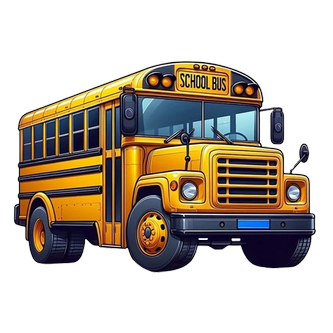

# 🚌 Smart Bus Tracking System 🚀

<p align="center">
  
</p>

<p align="center">
  
  
  
  
</p>

---

## 🌟 Overview
A comprehensive and robust Android application designed for real-time school bus tracking, attendance management, and centralized administrative control. Built to ensure student safety and provide parents with peace of mind. 🏫✨

---

## ✨ Key Features

### 🛡️ Admin Dashboard
- **👤 Driver Management:** Effortlessly add, update, and manage bus driver profiles.
- **🚍 Bus Management:** Maintain an organized list of the entire bus fleet.
- **🎓 Student Assignment:** Seamlessly assign students to specific buses and routes.
- **📍 Route Definition:** Define and optimize bus routes and individual stops (points).
- **🗺️ Live Tracking:** Monitor the real-time location of all active buses on an interactive map.
- **📢 Broadcast Alerts:** Send critical notifications and alerts to parents and drivers instantly.

### 🏁 Driver App Features
- **🛣️ Active Trip Management:** Start and end trips with a single tap.
- **🧭 Real-time Navigation:** Integrated map using **OSMDroid** for precise route guidance.
- **📝 Attendance Tracking:** Digital attendance marking (Picked up/Dropped off).
- **📡 Location Updates:** Automatic live location streaming to the Firebase database.

### 👨‍👩‍👧‍👦 Parent App Features
- **📍 Live Child Tracking:** Real-time visibility of the child's bus location during trips.
- **🔔 Proximity Alerts:** Automatic notifications when the bus is within 500m of the stop.
- **✅ Status Updates:** Instant alerts when the child is picked up or dropped off.
- **📞 Driver Contact:** Quick access to the assigned driver's contact information.
- **📢 School Broadcasts:** Receive important announcements directly from the admin.

---

## 🏗️ Architecture
The project follows the **MVVM (Model-View-ViewModel)** architectural pattern, ensuring a clean separation of concerns, easier testing, and maintainable code.

- **Model:** Data classes representing Bus, Driver, Parent, and Student entities.
- **View:** XML-based layouts and Activities for a responsive UI.
- **ViewModel/Logic:** Handles Firebase interactions and real-time data processing.

---

## 🛠️ Tech Stack

| Category | Technology |
| :--- | :--- |
| **Language** | [Kotlin](https://kotlinlang.org/) 💻 |
| **UI Framework** | XML Layouts & Material Design 3 🎨 |
| **Backend** | Firebase Realtime Database 🔥 |
| **Auth** | Firebase Authentication 🔐 |
| **Maps** | OSMDroid (OpenStreetMap) 🗺️ |
| **Location** | Google Play Services Location API 📍 |
| **Architecture** | MVVM Pattern 🏗️ |

---

## 📂 Project Structure

- `📂 app/src/main/java/.../Admin_Dashboard`: Management modules for fleet and users.
- `📂 app/src/main/java/.../Driver_Dashboard`: Trip management and navigation logic.
- `📂 app/src/main/java/.../Parent_Dashboard`: Tracking and notification systems.
- `📂 app/src/main/java/.../models`: Firebase data mapping classes.
- `📂 app/src/main/res/layout`: Modular XML UI definitions.

---

## 📸 Screenshots
*(Add your app screenshots here to showcase the UI)*

<p align="center">
  
  
  
</p>

---

## 🚀 Getting Started

### Prerequisites
- **Android Studio** (Iguana or newer recommended)
- **JDK 17**
- **Firebase Account**

### Setup Instructions
1. **📥 Clone the repository:**
   ```bash
   git clone <[repository-url](https://github.com/Aamish-247/Final-App-Project)>
   ```
2. **🏗️ Open in Android Studio:**
   Load the project and let Gradle sync.
3. **🔥 Firebase Setup:**
   - Create a project on [Firebase Console](https://console.firebase.google.com/).
   - Add your `google-services.json` file to the `app/` directory.
   - Enable **Realtime Database** and **Authentication** (Email/Password).
4. **📲 Run & Test:**
   Build and deploy the application on a physical device for the best GPS experience.

---

## 📜 License
This project is licensed under the **MIT License**.

---
<p align="center">
  Developed with ❤️ for safer school commutes.
</p>
